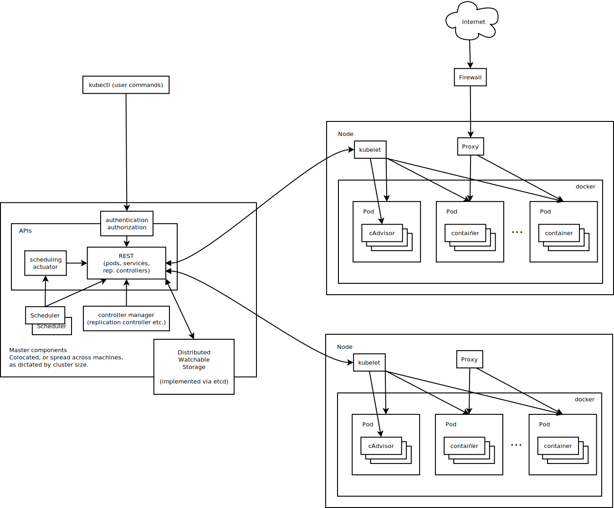

# Kubernetes<!-- omit in toc -->

[官方网站](https://kubernetes.io) | [中文文档](https://kubernetes.io/zh-cn/docs/home/) | [GitHub](https://github.com/kubernetes)

## 目录<!-- omit in toc -->

- [1. 概述](#1-概述)
  - [1.1. 特性](#11-特性)
  - [1.2. 结构和组件](#12-结构和组件)
- [2. 安装](#2-安装)
- [3. 最佳实践](#3-最佳实践)

## 1. 概述

Kubernetes，也称为 K8s，是一个开源的容器编排引擎，是云原生计算基金会（[CNCF](https://www.cncf.io/)） 的毕业项目。用来对容器化应用进行自动化部署、扩缩和管理。它将组成应用程序的容器组合成逻辑单元，以便于管理和服务发现。

Kubernetes 这个名字源于希腊语，意为 “舵手” 或 “飞行员”。k8s 这个缩写是因为 k 和 s 之间有八个字符的关系。

### 1.1. 特性

- 自动装箱：根据资源需求和其他限制自动放置容器，同时避免影响可用性。将关键性的和尽力而为性质的工作负载进行混合放置，以提高资源利用率并节省更多资源。

- 水平扩缩：使用一个简单的命令、一个 UI 或基于 CPU 使用情况自动对应用程序进行扩缩。

- 为扩展性设计：无需更改上游源码即可扩展你的 Kubernetes 集群。

- IPv4/IPv6 双协议栈：为 Pod 和 Service 分配 IPv4 和 IPv6 地址。

- 自动化上线和回滚（[Deployments](https://kubernetes.io/zh-cn/docs/concepts/workloads/controllers/deployment/)）：Kubernetes 会分步骤地将针对应用或其配置的更改上线，同时监视应用程序运行状况以确保你不会同时终止所有实例。如果出现问题，Kubernetes 会为你回滚所作更改。

- 服务发现与负载均衡（[Service](https://kubernetes.io/zh-cn/docs/concepts/services-networking/service/)）：使用 Kubernetes，你无需修改应用程序即可使用不熟悉的服务发现机制。Kubernetes 为 Pod 提供自己的 IP 地址，并为一组 Pod 提供相同的 DNS 名，并且可以在它们之间进行负载均衡。

- 自我修复（[ReplicaSet](https://kubernetes.io/zh-cn/docs/concepts/workloads/controllers/replicaset/#replicationcontroller-%e5%a6%82%e4%bd%95%e5%b7%a5%e4%bd%9c)）：重新启动失败的容器；在节点死亡时替换并重新调度容器；杀死不响应用户定义的健康检查的容器；并且在它们准备好服务之前不会将它们公布给客户端。

- 存储编排（[Persistent Volume](https://kubernetes.io/zh-cn/docs/concepts/storage/persistent-volumes/)）：自动挂载所选存储系统，包括本地存储、诸如 AWS 或 GCP 之类公有云提供商所提供的存储或者诸如 NFS、iSCSI、Ceph、Cinder 这类网络存储系统。

- Secret 和配置管理（[Secret](https://kubernetes.io/zh-cn/docs/concepts/configuration/secret/)）：部署和更新 Secret 和应用程序的配置而不必重新构建容器镜像，且不必将软件堆栈配置中的秘密信息暴露出来。

- 批量执行（[Job](https://kubernetes.io/zh-cn/docs/concepts/workloads/controllers/job/)）：除了服务之外，Kubernetes 还可以管理你的批处理和 CI 工作负载，在期望时替换掉失效的容器。

### 1.2. 结构和组件

如下图所示，左侧是主节点，其中的各类组件对集群进行全局的控制，k8s 称之为 “控制平面”。右侧是工作节点，可以是物理机器或者虚拟机，它会运行容器化的应用程序。开发人员通过命令行工具 kubectl 来操作控制平面从而管理集群，而终端用户则通过开放的互联网入口来访问用应用程序。  

以下分别介绍其中的每个组件：

控制平面组件（Control Plane Components）：控制平面组件会为集群做出全局决策，比如资源的调度。以及检测和响应集群事件，例如当不满足部署的 replicas 字段时，要启动新的 pod。控制平面组件可以在集群中的任何节点上运行，然而，为了简单起见，设置脚本通常会在同一个计算机上启动所有控制平面组件，并且不会在此计算机上运行用户容器。

- API 服务器（kube-apiserver）：该组件负责公开 Kubernetes API，负责处理接受请求的工作。API 服务器是 Kubernetes 控制平面的前端。kube-apiserver 设计上考虑了水平扩缩，也就是说，它可通过部署多个实例来进行扩缩。你可以运行 kube-apiserver 的多个实例，并在这些实例之间平衡流量。

- etcd：一致且高度可用的键值存储，用作 Kubernetes 的所有集群数据的后台数据库。

- 调度器（kube-scheduler）：负责监视新创建的、未指定运行节点（node）的 Pods，并选择节点来让 Pod 在上面运行。调度决策考虑的因素包括单个 Pod 及 Pods 集合的资源需求、软硬件及策略约束、亲和性及反亲和性规范、数据位置、工作负载间的干扰及最后时限。

- 控制器管理器（kube-controller-manager）：负责运行控制器进程。从逻辑上讲，每个控制器都是一个单独的进程，但是为了降低复杂性，它们都被编译到同一个可执行文件，并在同一个进程中运行。这些控制器包括：节点控制器（Node Controller）、任务控制器（Job Controller）、端点分片控制器（EndpointSlice controller）、服务账号控制器（ServiceAccount controller）等等。

工作节点组件：节点组件会在每个节点上运行，负责维护运行的 Pod 并提供 Kubernetes 运行环境。

- kubelet：在集群中每个节点（node）上运行。它保证容器（containers）都运行在 Pod 中。kubelet 接收一组通过各类机制提供给它的 PodSpecs，确保这些 PodSpecs 中描述的容器处于运行状态且健康。kubelet 不会管理不是由 Kubernetes 创建的容器。

- kube-proxy：在集群中每个节点（node）上运行的网络代理，实现 Kubernetes 服务（Service）概念的一部分。kube-proxy 维护节点上的一些网络规则，这些网络规则会允许从集群内部或外部的网络会话与 Pod 进行网络通信。如果操作系统提供了可用的数据包过滤层，则 kube-proxy 会通过它来实现网络规则，否则，kube-proxy 仅做流量转发。

- 容器运行时（Container Runtime）：容器运行环境是负责运行容器的软件。Kubernetes 支持许多容器运行环境，例如 containerd、CRI-O 以及 Kubernetes CRI（容器运行环境接口）的其他任何实现。

- Pod：是一组（一个或多个）容器，是可以在 Kubernetes 中创建和管理的、最小的可部署的计算单元。这些容器共享存储、网络、以及怎样运行这些容器的声明。Pod 中的内容总是并置（colocated）的并且一同调度，在共享的上下文中运行。Pod 所建模的是特定于应用的 “逻辑主机”，其中包含一个或多个应用容器，这些容器相对紧密地耦合在一起。除了应用容器，Pod 还可以包含在 Pod 启动期间运行的 Init 容器。

## 2. 安装

安装 kubernetes 的方式有很多种，最原始的方法就是分别下载官方提供的[各个组件的二进制包](https://www.downloadkubernetes.com/)然后手动部署和配置。而更加高效便捷的做法则是利用一些工具来协助安装：

用于学习：

- [Minikube](https://minikube.sigs.k8s.io/)：由 Kubernetes 社区维护的单机版的 Kubernetes 集群快速部署工具，支持 MacOS、Linux 以及 Windows 等操作系统。非常适合在自己本地的个人计算机上作为 Kubernetes 入门环境或作为开发测试环境使用，当然由于只支持单节点不支持高可用因此不能用于生产部署。

- [kind](https://kind.sigs.k8s.io/)：由 Kubernetes 社区新维护的一个使用 Docker 容器 “节点” 运行本地 Kubernetes 集群的工具。主要用于测试 Kubernetes 本身，但也可用于本地开发或 CI。

- [Docker Desktop](https://www.docker.com/products/docker-desktop/)：这是 Docker 官方提供的一个桌面应用程序，用于构建和共享容器化应用程序和微服务，其中包含了 Kubernetes。适用于 Mac、Linux 或 Windows 环境。

用于生产：

- [kubeadm](https://kubernetes.io/zh-cn/docs/reference/setup-tools/kubeadm/)：kubeadm 是和 Kubernetes 一块发布的集群部署工具，与 Kubernetes 在同一个代码仓库中，因此可以说 kubeadm 是 Kubernetes 最亲的部署工具，是目前使用最多，同时也是社区最为推荐的 Kubernetes 部署工具。其实很多其他的部署工具也都是基于 kubeadm 实现的，前面提到的 minikube、kind 等工具都是基于 kubeadm 实现的。

- [kubespray](https://kubespray.io)：Kubespray 使用 [Ansible](https://www.ansible.com/) 部署生产级别的 Kubernetes 集群。对于已经了解 Ansible 的人们来说，该工具是一个不错的选择，因为无需使用其他工具进行预配和编排。

- [Kops](https://kops.sigs.k8s.io/)：非常早就存在的一个项目，它不仅会帮助您创建、销毁、升级和维护生产级、高可用性的 Kubernetes 集群，还会提供必要的云基础设施。与各云平台整合度非常高，如果您使用了对应的云平台的话该工具是一个不错的选择，目前（2022.11）正式支持 AWS（Amazon Web Services）和 GCE （Google Cloud Platform），DigitalOcean、Hetzner 和 OpenStack 处于 beta 支持状态，Azure 处于 alpha 状态。

- [托管服务](https://kubernetes.io/zh-cn/docs/setup/production-environment/turnkey-solutions/)：如果你不想自己管理 Kubernetes 集群，则可以选择托管服务，包括国内的阿里云、腾讯云、百度云等等。

## 3. 最佳实践
