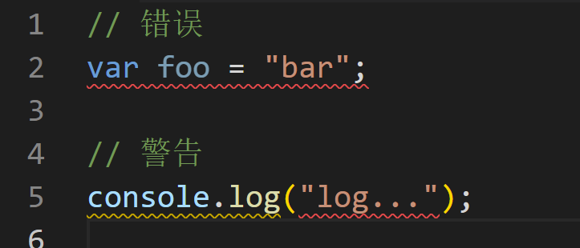
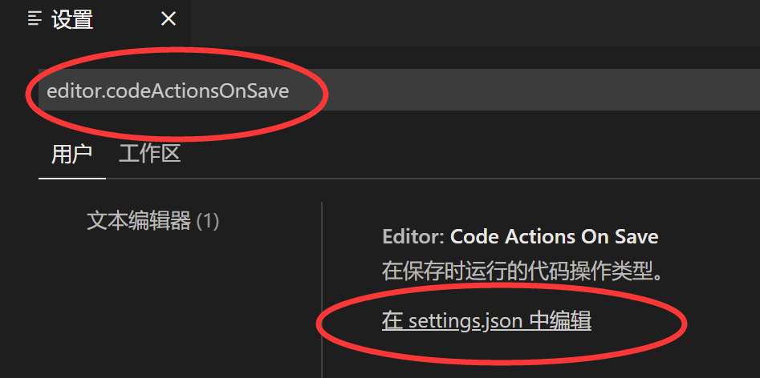
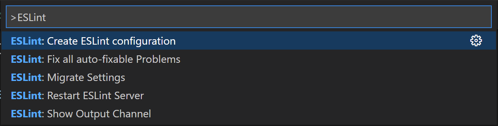
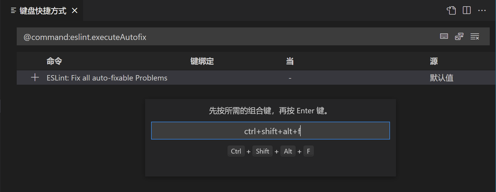

# 使用 VS Code 的 ESLint 插件

使用命令行命令来检查和修复代码的方式固然是不够方便、也不够直观的。使用 VS Code 编辑器的同学，则可以通过安装 [ESLint 插件](https://marketplace.visualstudio.com/items?itemName=dbaeumer.vscode-eslint)来改善这一点。

当目录中存在 ESLint 配置文件时，ESLint 插件会自动读取并应用它。

## 实时提示错误和警告

插件安装成功后，文件中 ESLint 的错误或警告，会在相应的代码处以底部波浪线的形式实时展示。错误代码展示红色波浪线，警告类代码展示黄色波浪线。如下图所示：



除此之外，在文件标签页、资源管理器、状态栏以及缩略图处也都会有相应的提示。

## 保存时自动修复代码

可以通过修改 VS Code 编辑器配置来使每次保存代码时自动修复那些可以自动修复的错误和警告，类似 `--fix` 功能。配置方法如下：

键盘按下 `ctrl + ,` 打开配置面板并搜索 `editor.codeActionsOnSave`，然后点击 “在 settings.json 中编辑”，如下图所示：



在 settings.json 中添加以下配置项即可：

```JSON
{
  "editor.codeActionsOnSave": {
    "source.fixAll.eslint": true
  }
}
```

## 设置快捷键修复代码

ESLint 插件默认提供了一些编辑器命令供我们使用，其中就包括修复代码命令，键盘按下 `ctrl + shift + p` 打开命令面板，输入 `ESLint` 来过滤命令，可以看到所列出的所有 ESLint 命令，点击或回车即执行选中命令。



在命令列表中，选中 `ESLint: Fix all auto-fixable Problems` 命令，点击其右侧的齿轮图标，打开快捷键配置页面，双击弹出输入框，此时按下喜欢的快捷键后回车即可。


