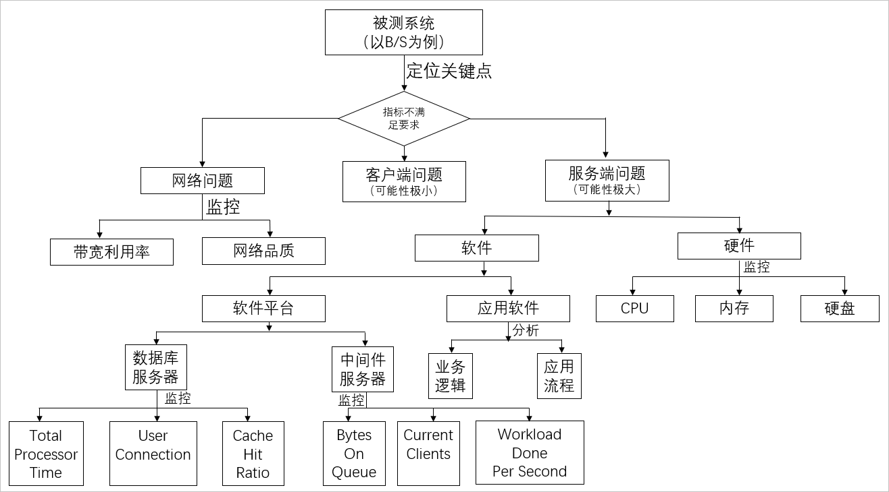

# 分析和调优<!-- omit in toc -->

- [1. 前提](#1-前提)
- [2. 流程](#2-流程)
- [3. 可能瓶颈点](#3-可能瓶颈点)
- [4. 方法](#4-方法)

## 1. 前提

性能分析的前提除了需要丰富的性能测试监控，还需要具备相关的技术知识（包括但不限于：操作系统、中间件、数据库、开发等）。

## 2. 流程

1. 很多情况下压测流量并没有完全进入到后端（服务端），在网络接入层（云化的架构，例如：负载均衡/WAF/高防 IP，甚至是 CDN/全站加速等）可能就会出现由于各种规格（带宽、最大连接数、新建连接数等）限制或者因为压测的某些特征符合 CC 和 DDoS 的行为而触发了防护策略导致压测结果达不到预期。
2. 接着看关键指标是否满足要求，如果不满足，需要确定是哪个地方有问题，一般情况下，服务器端问题可能性比较大，也有可能是客户端问题（这种情况非常小）。
3. 对于服务器端问题，需要定位的是硬件相关指标，例如 CPU，Memory，Disk I/O，Network I/O，如果是某个硬件指标有问题，需要深入的进行分析。
4. 如果硬件指标都没有问题，需要查看中间件相关指标，例如：线程池、连接池、GC 等，如果是这些指标问题，需要深入的分析。
5. 如果中间件相关指标没问题，需要查看数据库相关指标，例如：慢查 SQL、命中率、锁、参数设置。
6. 如果以上指标都正常，应用程序的算法、缓冲、缓存、同步或异步可能有问题，需要具体深入的分析。

如下图所示：

## 3. 可能瓶颈点

- 硬件规格上的瓶颈：一般指的是 CPU、内存、磁盘 I/O 方面的问题，分为服务器硬件瓶颈、网络瓶颈（对局域网可以不考虑）。
- 中间件上的性能瓶颈：一般指的是应用服务器、web 服务器等应用软件，还包括数据库系统。例如：中间件 weblogic 平台上配置的 JDBC 连接池的参数设置不合理，造成的瓶颈。
- 应用程序上的性能瓶颈：一般指的是开发人员开发出来的应用程序。例如：JVM 参数不合理、容器配置不合理、慢 SQL、数据库设计不合理、程序架构规划不合理、程序本身设计有问题（串行处理、请求的处理线程不够、无缓冲、无缓存、生产者和消费者不协调等），造成系统在大量用户访问时性能低下而造成的瓶颈。
- 操作系统上的性能瓶颈：一般指的是 windows、UNIX、Linux 等操作系统。例如：在进行性能测试，出现物理内存不足时，虚拟内存设置也不合理，虚拟内存的交换效率就会大大降低，从而导致行为的响应时间大大增加，这时认为操作系统上出现性能瓶颈。
- 网络设备上的性能瓶颈：一般指的是防火墙、动态负载均衡器、交换机等设备。当前更多的云化服务架构使用的网络接入产品：包括但不限于：负载均衡、WAF、高防 IP、CDN、全站加速等等。例如：在动态负载均衡器上设置了动态分发负载的机制，当发现某个应用服务器上的硬件资源已经到达极限时，动态负载均衡器将后续的交易请求发送到其他负载较轻的应用服务器上。在测试时发现，动态负载均衡器没有起到相应的作用，这时可以认为网络瓶颈。

## 4. 方法

- CPU：CPU 资源利用率很高的话，需要看 CPU 消耗 User、Sys、Wait 哪种状态。
  - 如果 CPU User 非常高，需要查看消耗在哪个进程，可以用 top（linux）命令看出，接着用 `top –H –p <pid>` 看哪个线程消耗资源高。如果是 Java 应用，就可以用 jstack 看出此线程正在执行的堆栈，看资源消耗在哪个方法上，查看源代码就知道问题所在；如果是 c++应用，可以用 gprof 性能工具进行分析。
  - 如果 CPU Sys 非常高，可以用 strace（linux）看系统调用的资源消耗及时间。
  - 如果 CPU Wait 非常高，考虑磁盘读写了，可以通过减少日志输出、异步或换速度快的硬盘。
- Memory：操作系统为了最大化利用内存，一般都设置大量的 cache，因此，内存利用率高达 99% 并不是问题，内存的问题主要看某个进程占用的内存是否非常大以及是否有大量的 swap（虚拟内存交换）。
- 磁盘 I/O：一个最显著的指标是繁忙率，可以通过减少日志输出、异步或换速度快的硬盘来降低繁忙率。
- 网络 I/O：主要考虑传输内容大小，不能超过硬件网络传输的最大值 70%，可以通过压缩减少内容大小、在本地设置缓存以及分多次传输等操作提高网络 I/O 性能。
- 内核参数：一般都有默认值，这些内核参数默认值对于一般系统没问题，但是对于压力测试来说，可能运行的参数将会超过内核参数，导致系统出现问题，可以用 sysctl 来查看及修改。
- JVM：主要分析 GC/FULL GC 是否频繁，以及垃圾回收的时间，可以用 jstat 命令来查看，对于每个代大小以及 GC 频繁，通过 jmap 将内存转储，再借助工具 HeapAnalyzer 来分析哪地方占用的内存较高以及是否有内存泄漏可能。
- 线程池：如果线程不够用，可以通过参数调整，增加线程；对于线程池中的线程设置比较大的情况，还是不够用可能的原因是：某个线程被阻塞来不及释放，可能在等锁、方法耗时较长、数据库等待时间很长等原因导致，需要进一步分析才能定位。
- JDBC 连接池：连接池不够用的情况下，可以通过参数进行调整增加；但是对于数据库本身处理很慢的情况下，调整没有多大的效果，需要查看数据库方面以及因代码导致连接未释放的原因。
- SQL：SQL 效率低下也是导致性能差的一个非常重要的原因，可以通过查看执行计划看 SQL 慢在哪里，一般情况，SQL 效率低下原因主要有：

| 类别   | 子类                        | 表达式或描述                                             | 原因                                                                    |
| ------ | --------------------------- | -------------------------------------------------------- | ----------------------------------------------------------------------- |
| 索引   | 未建索引                    | 无                                                       | 产生全表扫描                                                            |
| 索引   | 未利用索引                  | substring(card_no,1,4)=′5378′                            | 产生全表扫描                                                            |
| 索引   | 未利用索引                  | amount/30< 1000                                          | 产生全表扫描                                                            |
| 索引   | 未利用索引                  | convert(char(10),date,112)=′19991201′                    | 产生全表扫描                                                            |
| 索引   | 未利用索引                  | where salary<>3000                                       | 产生全表扫描                                                            |
| 索引   | 未利用索引                  | name like '%张'                                          | 产生全表扫描                                                            |
| 索引   | 未利用索引                  | first_name + last_name ='beill cliton'                   | 产生全表扫描                                                            |
| 索引   | 未利用索引                  | id_no in(′0′,′1′)                                        | 产生全表扫描                                                            |
| 索引   | 未利用索引                  | select id from t where num=@num                          | 有参数也会产生全表扫描                                                  |
| 索引   | 使用效能低的索引            | oder by 非聚簇索引                                       | 索引性能低                                                              |
| 索引   | 使用效能低的索引            | username='张三'and age>20                                | 字符串索引低于整形索引                                                  |
| 索引   | 使用效能低的索引            | 表中列与空 NULL 值                                       | 索引性能低                                                              |
| 索引   | 使用效能低的索引            | 尽量不要使用 IS NULL 或 IS NOT NULL                      | 索引性能低                                                              |
| 数据量 | 所有数据量                  | select \*                                                | 很多列产生大量数据                                                      |
| 数据量 | 所有数据量                  | select id,name                                           | 表中有几百万行，产生大量数据                                            |
| 数据量 | 嵌套查询                    | 先不过滤数据，后过滤数据                                 | 产生大量无用的数据                                                      |
| 数据量 | 关联查询                    | 多表进行关联查询，先过滤掉小部分数据，在过滤大部分数据   | 大量关联操作                                                            |
| 数据量 | 大数据量插入                | 一次次插入                                               | 产生大量日志，消耗资源                                                  |
| 锁     | 锁等待                      | update account set banlance=100 where id=10              | 产生表级锁，将会锁住整个表                                              |
| 锁     | 死锁                        | A:update a;update b;B:update b;update a;                 | 将会产生死锁                                                            |
| 锁     | 游标                        | Cursor Open cursor,fetch;close cursor                    | 性能很低                                                                |
| 锁     | 临时表                      | create tmp table 创建临时表                              | 产生大量日志                                                            |
| 锁     | drop table                  | 删除临时表                                               | 需要显示删除，避免系统表长时间锁定                                      |
| 其他   | exist 代替 IN               | select num from a where num in(select num from b)        | in 会逐个判断，exist 有一条就结束                                       |
| 其他   | exist 代替 select count(\*) | 判断记录是否存在                                         | count(\*) 将累加计算，exist 有就结束                                    |
| 其他   | between 代替 IN             | ID in(1,2,3)                                             | IN 逐个判断，between 是范围判断                                         |
| 其他   | left outer join 代替 Not IN | select ID from a where ID not in(select b.Mainid from b) | NOT IN 逐个判断，效率非常低                                             |
| 其他   | union all 代替 union        | select ID from a union select id from b union            | 删除重复的行，可能会在磁盘进行排序而 union all 只是简单的将结果并在一起 |
| 其他   | 常用 SQL 尽量用绑定变量方法 | insert into A(ID) values(1)                              | 直接写 SQL 每次都要编译，用绑定变量的方法只编译一次，下次就可以用了     |
