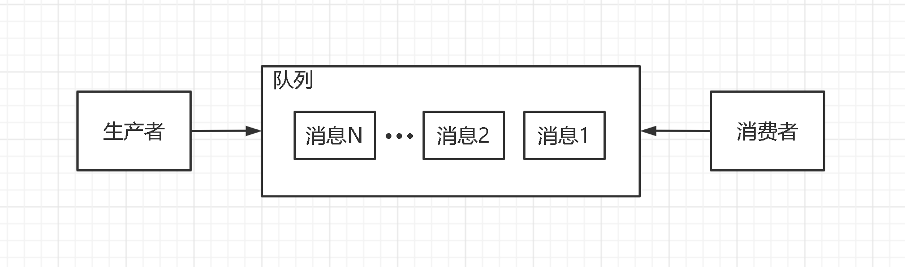
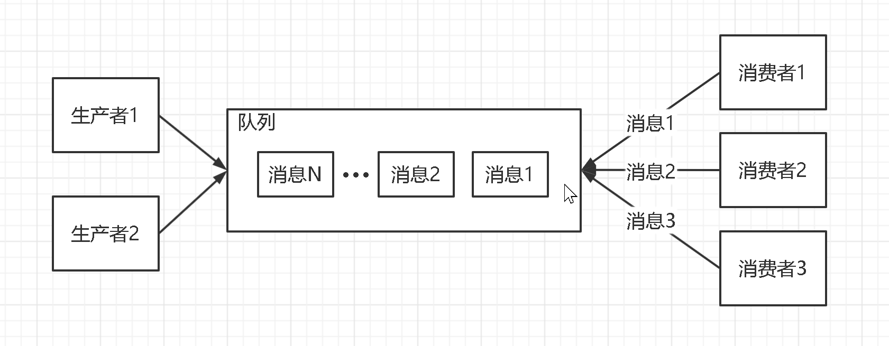
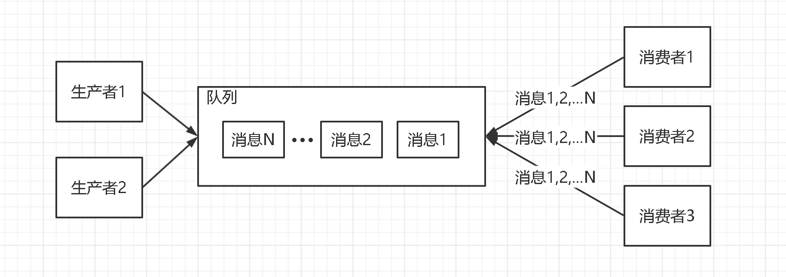

# 消息队列<!-- omit in toc -->

- [1. 概述](#1-概述)
- [2. 传输模型](#2-传输模型)
- [3. 应用场景](#3-应用场景)
- [4. 开源实现](#4-开源实现)

## 1. 概述

在计算机科学中，消息队列（英文全称 Message queue，缩写为 MQ）是一种进程间或同一进程的不同线程间的通信方式。消息队列提供了异步的通信协议，消息的发送者和接收者不需要同时与消息队列交互，消息会保存在队列中，直到接收者取回它。

在典型的消息队列实现中，其用法通常是：

- 系统管理员安装和配置消息队列软件，并定义一个命名的队列（Queue）。
- 然后应用程序注册一个软件例程，该例程 “侦听” 放置在队列中的消息（Message），这类应用程序称为 “消息消费者（Consumer）”。
- 另外一些应用程序会连接到队列并将消息传输到队列中，这类应用程序称为 “消息生产者（Producer）”。

## 2. 传输模型

主流的消息队列中间件的传输模型主要为点对点模型和发布订阅模型。

**点对点模型**：最大特点就是不管同一个队列的下游存在多少个消费者，每一条消息都只会被唯一一个消费者处理。如下图所示。

**发布订阅模型**：消息生产者和消息消费者只有建立了订阅关系才能收到消息，当消息生产者发布一个消息，所有订阅这个队列的消费者都能得到这个消息。如下图所示。

## 3. 应用场景

- 流量削峰：主要用于在高并发情况下，业务异步处理，提供高峰期业务处理能力，避免系统瘫痪。假设系统只能处理 1000 个请求，但这时突然来了 3000 个请求，如果不加以限制就会造成系统瘫痪。此时便可使用消息队列做缓冲，将多余的请求存放在消息队列中，等高峰期过后再慢慢处理队列里的消息。

- 应用解耦：主要用于当一个业务需要多个模块共同实现，或者一条消息有多个系统需要对应处理时，只需要主业务完成以后，发送一条消息，其余模块消费消息，即可实现业务，降低模块之间的耦合。比如某个服务 A 调用服务 B，如果服务 B 突然出现问题，会导致服务 A 也无法使用，使用消息队列即可将其解耦。

- 异步通信：主业务执行结束后从属业务通过 MQ 异步执行，减低业务的响应时间，提高用户体验。假设有一个业务，要先执行服务 A，然后调用服务 B，再调用服务 C，这个业务需要一步步走下去。当使用了消息队列之后，服务 A 完成之后即可立即响应，且可以同时执行服务 B 和 服务 C，这样就减低前端业务的响应时间，提高用户体验。

## 4. 开源实现

- Kafka：是为大数据而生的消息中间件。适用于处理海量消息，例如日志、监控信息或前端埋点等，或大数据和流计算领域。
  - 优点
    - 是 Apache 的顶级项目。
    - 与周边生态系统的兼容性很好，尤其是在大数据和流计算领域，几乎所有相关开源软件系统都会优先支持 kafka。
    - 单机吞吐量每秒百万级，时效性毫秒级，高可用，不会丢失消息。
  - 缺点
    - 同步收发消息的响应时延比较高，不太适合在线业务场景。
- RocketMQ：是阿里系下开源的一款分布式、队列模型的消息中间件，是阿里参照 kafka 设计思想使用 java 实现的一套消息队列。适用于处理在线业务，例如订单传递，具有金融级别的稳定性。
  - 优点
    - 是阿里云捐献给 Apache 软件基金会的开源消息队列，是 Apache 的顶级项目。
    - 在阿里内部经历多次 “双十一” 的考验，性能、稳定性和可靠性值得信赖。
    - 有非常活跃中文社区，大多数问题可以找到中文答案。
    - 使用 java 开发的，且贡献者大多数是中国人，源码容易读懂。
    - 对在线业务的响应时延做了很多优化，大多数情况下可以做到毫秒级相应。
    - 性能比 RabbitMQ 要高一个数量级，每秒大概能处理几十万条消息。
    - 消息可以做到 0 丢失，支持 10 亿级别的消息堆积。
  - 缺点
    - 在国际上还没有那么流行，与周边生态系统的集成和兼容程度略逊一筹。
- RabbitMQ：是使用 Erlang 编写的一个开源的消息队列。适用于对消息队列功能和性能没有高要求，只需要一个开箱即用的易于维护的产品。
  - 优点
    - 是少数几个支持 AMQP 协议的消息队列之一。
    - 轻量级，易部署。
    - 全球使用率最高。
    - RabbitMQ 客户端支持的编程语言，大概是所有消息队列中最多的。
  - 缺点
    - 小众语言 Erlang 编写，该语言学习曲线非常陡峭，一旦有需要改源码会非常麻烦。
    - 对消息堆积的支持并不好，有消息堆积会导致性能急剧下降。
    - 性能是其他几个消息队列产品中最差的，但是每秒也可以处理几万到十几万的消息。
    - 在生产者和队列之间增加了 Exchange 模块，类似路由，可以配置路由将生产者的消息分发到不同的队列中，与另外两个队列产品的数据模型不同。假如适用阿里云的 RabbitMQ，某些情况下，需要通过 Exchange 将消息转发到多个队列，会有额外费用，因为队列数量会涉及费用。
- Redis：通过其列表结构、发布订阅结构，以及 Stream 结构实现。
  - 优点
    - 轻量级。
  - 缺点
    - 功能相对较少。
    - 如果消息积压过大，会给内存造成过重负担。
