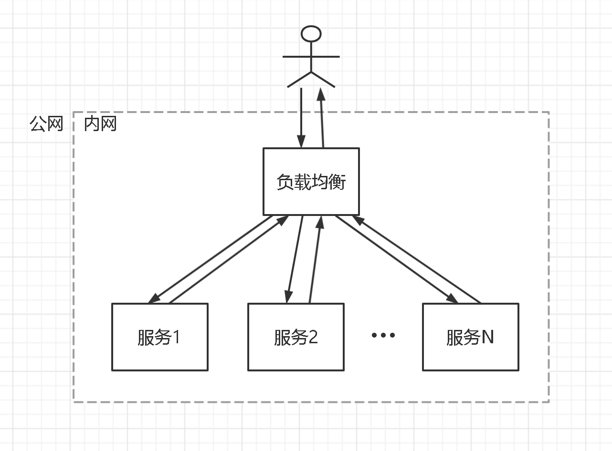
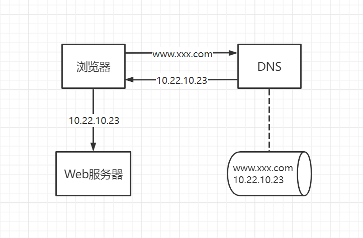
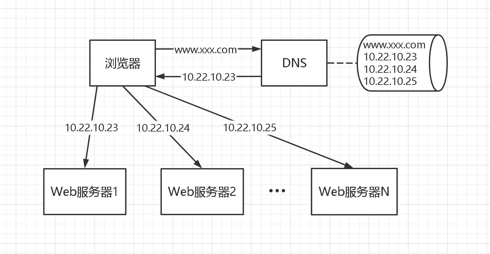
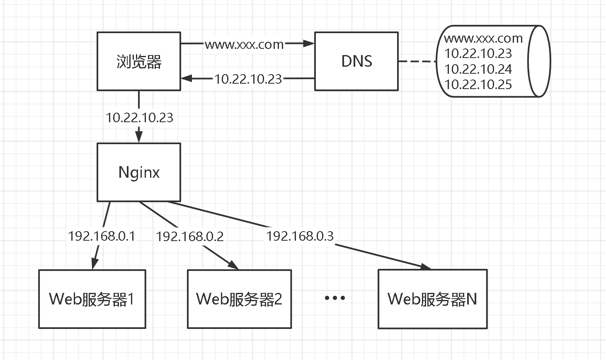
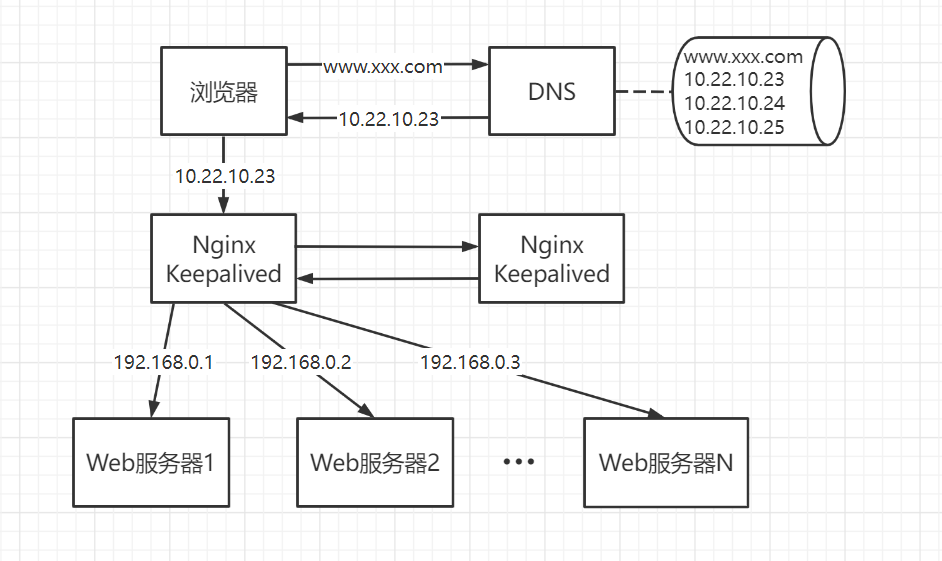
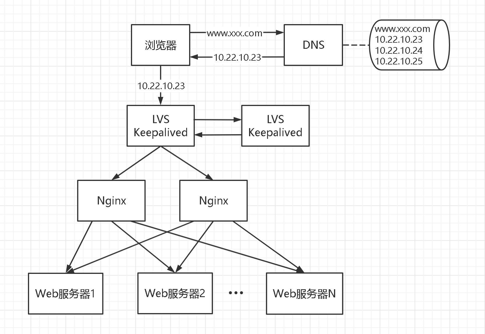

# 负载均衡（Web 应用）<!-- omit in toc -->

## 目录<!-- omit in toc -->

- [1. 概述](#1-概述)
- [2. 调度算法](#2-调度算法)
- [3. 特性](#3-特性)
- [4. 常用工具及架构演进](#4-常用工具及架构演进)
  - [4.1. 单机架构](#41-单机架构)
  - [4.2. 使用 DNS 轮询](#42-使用-dns-轮询)
  - [4.3. 使用 Nginx](#43-使用-nginx)
  - [4.4. 使用 Keepalived](#44-使用-keepalived)
  - [4.5. 使用 LVS](#45-使用-lvs)

## 1. 概述

负载均衡（英文 load balancing）是一种电子计算机技术，用来在多个计算机（计算机集群）、网络连接、CPU、磁盘驱动器或其他资源中分配负载，以达到优化资源使用、最大化吞吐率、最小化响应时间，同时避免过载的目的。

负载均衡最重要的应用之一是利用多台服务器提供单一的 Internet 服务。将大量作业合理地分摊到多个操作单元上进行执行，用于解决互联网架构中的高并发和高可用问题。通常，负载均衡系统包括流行的网站、大型 Internet 中继聊天网络、高带宽文件传输协议（FTP）站点、网络新闻传输协议（NNTP）服务器、域名系统（DNS）服务器和数据库。

对于互联网服务，负载均衡器通常是一个软件程序，这个程序侦听一个外部端口，互联网用户可以通过这个端口来访问服务，而作为负载均衡器的软件会将用户的请求转发给后台内网服务器，内网服务器将请求的响应返回给负载均衡器，负载均衡器再将响应发送到用户。负载均衡器会根据一定的算法来调度内网服务器以达到均衡负载的目的。

## 2. 调度算法

负载均衡器有各种各样的工作调度算法，来确定将请求发送到哪个后端服务器。最简单的是随机选择和轮询。更为高级的负载均衡器会考虑其它更多的相关因素，比如后台服务器的负载、响应时间、运行状态、活动连接数、地理位置、处理能力，或最近分配的流量。

- 轮询法：请求到达后，将客户端发送到负载均衡器的请求依次轮流地转发给服务集群的节点。这种算法实现简单，每个集群节点平均分担所有的请求，但是当集群中服务器硬件配置不同、性能差别大时，无法区别对待。
- 随机法：随机选取集群中的某个节点来处理该请求。由概率论的知识可知，随着请求量的变大，随机算法会逐渐演变为轮询算法，即集群各个节点会处理差不多数量的请求。
- 最小连接法：根据集群的每个节点的当前连接数来决定将请求转发给哪个节点，即每次都将请求转发给当前存在最少并发连接的节点。
- 加权法：根据集群的节点对应机器的性能的差异，给每个节点设置一个权重值，其中性能好的机器节点设置一个较大的权重值，而性能差的机器节点则设置一个较小的权重值。权重大的节点能够被更多的选中。它是和随机、轮训一起使用的。可以根据机器的具体情况，分配不同的负载，达到能者多劳。
- Hash 法：将对请求的 IP 地址或者 URL 计算一个哈希值，然后与集群节点的数量进行取模来决定将请求分发给哪个集群节点。它不是真正意义上的负载均衡，在某些意义上也是一个单点服务。如果某个节点挂了，会使得一部分流量不可用。

## 3. 特性

- 服务器健康检查：负载均衡器可以检查后台服务器应用层的健康状况并从服务器池中移除那些出现故障的服务器。
- 内容过滤：有些负载均衡器可以按要求修改通过它的数据。
- HTTP 缓存：负载均衡器可以存储静态内容，当用户请求它们时可以直接响应用户而不必再向后台服务器请求。
- HTTP 安全：有些负载均衡器可以隐藏 HTTP 出错页面，删除 HTTP 响应头中的服务器标示信息，加密 cookies 以防止用户修改。平台。
- HTTP 压缩。使用 gzip 和 Deflate 等算法压缩 HTTP 数据，以减少网络上的数据传输量。对于响应时间较长，传输距离较远的用户，这一特性对于缩短响应时间效果明显。这个特性会耗费负载均衡器更多的 CPU，这一功能也可以由 Web 服务器来完成。
- 不对称负载调节：可以对后台服务器设置权重因子，权重因子用于控制服务器的请求处理量，进而控制服务器的负载。当后台服务器的处理能力不是等同的时候，这是一种控制服务器负载的简单方法。
- 优先启动：当出现故障的服务器达到某个阈值，或者服务器负载过高时，备用服务器必需可以及时上线提供服务。
- SSL 截断和加速：负载均衡器可将 SSL 通讯截断在负载均衡器上，再将用户请求转发给后台前将 HTTPS 变为 HTTP。
- DDOS 攻击防护：负载均衡器可以提供例如 SYN cookies 特性和延时绑定来减缓 SYN flood 攻击，并且通常将工作从服务器分载到更有效的
- TCP offload：不同的厂商叫法可能不一样。其主要思想是一样的，通常每个用户的每个请求都会使用一个不同的 TCP 连接，这个特性利用 HTTP/1.1 将来自多个用户的多个请求合并为单个 TCP socket 再转发给后台服务器。
- TCP 缓冲：负载均衡器可以暂存后台服务器对客户的响应数据，再将它们转发给那些响应时间较长网速较慢的客户，如此后台 Web 服务器就可以释放相应的线程去处理其它任务如直接整个响应数据直接发送给网速较快的用户。
- 后台服务器直接响应用户（Direct Server Return）：这是不对称负载分布的一项功能，在不对称负载分布中请求和回应通过不同的网络路径。
- 优先队列：也可称之为流量控制。它可以对不同的内容设定不同的优先级。
- 内容感知开关（Content-aware switching）：大多数负载均衡器可以基于用户请求的 URL 发送请求到不同的后台服务器，无论内容是加密（HTTPS）还是没有加密（HTTP）。
- 用户授权：对来自不同身份验证源的用户进行验证，然后再允许他们访问一个网站。
- 可编程的流量控制：不只一种负载均衡器允许使用脚本编程来定制负载均衡方法、任意的流量控制以及其它功能。
- 防火墙功能：由于安全的原因，不允许用户直接访问后台服务器。防火墙是由一系列规则构成，它们决定着哪些请求可以通过一个接口而哪些不被允许。
- 入侵阻止功能：在防火墙保障网络层/传输层安全的基础上，提供应用层安全防范。

## 4. 常用工具及架构演进

### 4.1. 单机架构

如上图所示，这是一个简单的 Web 架构（不涉及负载均衡），浏览器通过 DNS 服务器将域名解析为 IP 地址，然后访问到 Web 服务器。

该架构的问题在于：

- 可用性低：Web 服务故障整个系统就停止服务；
- 扩展性差：达到单机性能上限后无法扩容。

### 4.2. 使用 DNS 轮询

如上图所示，多部署几台 Web 服务器，然后将域名解析到这些服务器的 IP，DNS 服务器会将解析请求随机分配到不同的 IP 上，这样就完成了简单的负载均衡。这种负载均衡方式称为 “DNS 轮询”。

该架构的优点有：

- 零成本：在 DNS 服务器上多配几个 IP 即可，功能也不收费；
- 部署简单：多部署几个 Web 服务即可，原系统架构不需要做任何改造。

该架构的问题在于：

- 可用性低：DNS 服务只负责域名解析，对应的服务是否可用是不保证的，假设有一个 Web 服务挂了，部分服务会受到影响。
- 扩容非实时：DNS 解析有一个生效周期。
- 解析存在缓存：DNS 服务器是按照一定的层次结构组织的，本地 DNS 服务器会缓存已解析的域名到 IP 地址的映射，这会导致使用该 DNS 服务器的用户在一段时间内访问的是同一台 Web 服务器。此外，用户本地计算机也会缓存已解析的域名到 IP 地址的映射。

### 4.3. 使用 Nginx

如上图所示，站点层与浏览器层之间加入了一个反向代理层，利用高性能的 Nginx 来做反向代理，Nginx 会将 HTTP 请求分发给后端多个 Web 服务。

该架构的优点有：

- 高可用性：任何一台服务器挂掉，Nginx 可以将流量迁移到其他服务器；
- 扩容实时：Nginx 内部可控，随时增加 Web 服务器随时实时扩容。

该架构的问题在于：

- 时延增加且架构更复杂了：中间多加了一个反向代理层；
- 反向代理层成了单点：Web 服务挂掉不影响服务，当时 Nginx 挂掉则影响服务。

### 4.4. 使用 Keepalived

如上图所示，做两台 Nginx 组成一个集群，分别部署上 Keepalived，设置成相同的虚 IP，保证 Nginx 的高可用，当一台 Nginx 挂了，Keepalived 能够探测到，并将流量自动迁移到另一台 Nginx 上，整个过程对调用方透明。

该架构的问题在于：

- Nginx 仍然是接入单点，如果接入吞吐量超过的 Nginx 的性能上限后无法扩容。

### 4.5. 使用 LVS

如上图所示，通过 LVS 来扩展多个 Nginx，同时通过 Keepalived 保证 LVS 的可用性。
