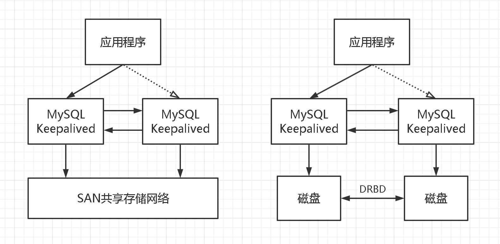

# MySQL 高可用性<!-- omit in toc -->

## 目录<!-- omit in toc -->

- [1. 冷备份](#1-冷备份)
- [2. 共享存储](#2-共享存储)
- [3. 基于 MySQL 原生复制](#3-基于-mysql-原生复制)
  - [3.1. MMM](#31-mmm)
  - [3.2. MHA](#32-mha)
  - [3.3. MySQL InnoDB ReplicaSet](#33-mysql-innodb-replicaset)
- [4. 集群式](#4-集群式)
  - [4.1. MySQL Group Replication（MGR）](#41-mysql-group-replicationmgr)
  - [4.2. MySQL InnoDB Cluster](#42-mysql-innodb-cluster)
  - [4.3. MySQL InnoDB ClusterSet](#43-mysql-innodb-clusterset)
  - [4.4. Galera Cluster](#44-galera-cluster)

## 1. 冷备份

实现思路：

- 冗余备份：定期地将数据复制到存储介质中（磁带、光盘等）并物理存档保存，一般是使用脚本定期执行。
- 故障转移：将备份文件拷贝回工作目录即完成恢复过程。或者修改数据库的配置，直接将备份的目录修改为数据库工作目录。

冷备份的优点是简单、廉价。但是对于现如今的很多场景，已经不好用了，因为：

- 服务需要停机。n 个 9 肯定无法做到了。然后，以前停机冷备是在凌晨没有人使用的时候进行，但是现在很多的互联网应用已经是面向全球了，所以，任何时候都是有人在使用的。
- 数据丢失。如果不采取措施，那么在完成了数据恢复后，备份时间点到还原时间内的数据会丢失。传统的做法，是冷备还原以后，通过数据库日志手动恢复数据。
- 冷备是全量备份。全量备份会造成磁盘空间浪费，以及容量不足的问题，只能通过将备份拷贝到其他移动设备上解决。所以，整个备份过程的时间其实更长了。

## 2. 共享存储

共享存储实现了数据库服务器和存储设备的解耦，比较典型的是 SAN 共享存储和 DRBD 磁盘复制。基本思路如下：

- 冗余备份：共享存储设备（比如 SAN）；或同步复制存储数据（比如 DRBD）。
- 故障转移：手动切换主从服务器；或借助工具（比如 Keepalive）实现自动切换。

如下图所示：

## 3. 基于 MySQL 原生复制

MySQL 的复制功能，之前叫做 Master Slave replication，现在改为 Source Replica replication。当 MySQL 开启该功能后，能够将 MySQL 服务器所产生的全部事件记录在一个二进制日志（binlog）内。MySQL 的复制功能将 binlog 传递到另外一台服务器（可以将其称之为从服务器，Slave 或者 Replica，发送 binlog 的服务器称之为主服务器），从服务器接受到 binlog 后，将日志记录的事件进行应用，以此达到两台服务器数据一致的目的，因此实现了复制。

### 3.1. MMM

MMM（Master-Master replication manager for MySQL）是一套支持双主故障切换和双主日常管理的脚本程序，使用 Perl 语言开发，主要用来监控和管理 MySQL Master-Master（双主）复制。虽然叫做双主复制，但是业务上同一时刻只允许对一个主进行写入，另一台备选主上提供部分读服务，以加速在主主切换时刻备选主的预热，可以说 MMM 这套脚本程序一方面实现了故障切换的功能，另一方面其内部附加的工具脚本也可以实现多个 slave 的 read 负载均衡。

优点：高可用性，扩展性好，出现故障自动切换，对于主主同步，在同一时间只提供一台数据库写操作，保证数据的一致性。当主服务器发生故障后，另一个主服务器立即接管，其他的从服务器能自动切换，不用人工干预。

缺点：监控节点会发生单点故障。并且对主机的数量有要求，至少三个节点。如果需要实现读写分离，还需要在前端编写读写分离程序。在读写非常繁忙的业务系统下表现不是很稳定，可能会出现复制延时、切换失效等问题。MMM 方案并不太适应于对数据安全性要求很高，并且读、写繁忙的环境中。

### 3.2. MHA

MHA（Master High Availability）目前在 MySQL 高可用方面是一个相对成熟的解决方案，是一套优秀的作为 MySQL 高可用性环境下故障切换和主从提升的高可用软件。在 MySQL 故障切换过程中，MHA 能做到在 0~30 秒之内自动完成数据库的故障切换操作，并且在进行故障切换的过程中，MHA 能在最大程度上保证数据的一致性，以达到真正意义上的高可用。

该软件由 MHA Manager（管理节点）和 MHA Node（数据节点）两部分组成，可以单独部署在一台独立的机器上管理多个 master-slave 集群，也可以部署在一台 slave 节点上。MHA Node 运行在每台 MySQL 服务器上，MHA Manager 会定时探测集群中的 master 节点，当 master 出现故障时，它可以自动将最新数据的 slave 提升为新的 master，然后将所有其他的 slave 重新指向新的 master。整个故障转移过程对应用程序完全透明。

优点：可以非常快速地完成故障转移及提升从服务器角色、主服务崩溃时不会导致数据不一致、用户无需修改当前 MySQL 设置、不会产生性能损失并且适用于任何存储引擎。

缺点：随着 MySQL 官方的高可用方案不断推出，作者已经意识到，曾经 MHA 所解决的问题，已经逐渐被官方的解决方案所代替，因此，从 MySQL8.0 开始，作者已经不在对 MHA 进行开发和维护。

### 3.3. MySQL InnoDB ReplicaSet

MySQL InnoDB ReplicaSet 整合了 MySQL 相关技术，用户能够通过 MySQL Shell 部署和管理 MySQL 主从复制。InnoDB ReplicaSet 至少由两台 MySQL 服务器实例组成，并提供用户熟知的 MySQL 主从复制功能，例如，读取横向扩展和数据安全性。

MySQL InnoDB ReplicaSet 基于异步的主从复制实现，因此适用于用户对高可用性要求不高的环境，用户可以通过 MySQL Shell 快速搭建及管理主从复制，避免了搭建主从复制时，大量的手动操作。

## 4. 集群式

### 4.1. MySQL Group Replication（MGR）

MySQL Group Replication，缩写为 MGR，即组复制，是 MySQL 官方推荐的一款高可用集群方案。MGR 基于分布式协议 Paxos，实现组复制，彻底解决了传统的异步复制和半同步复制中数据一致性无法保证的问题。

当客户端发起一个更新事务时，该事务先在本地执行。执行完成之后，在发起事务的提交之前，会将产生的 write set 广播到其他节点，集群中节点进行冲突检测。如果冲突检测成功，达成一致，组内决定该事务可以提交，其它成员可以应用，否则就回滚。最终，所有组内成员以相同的顺序接收同一组事务。因此组内成员以相同的顺序应用相同的修改，保证组内数据强一致性。

MGR 的两种模式：

- 单主模式：组复制具有自动选主功能，每次只有一个 Server 成员接受更新，其它成员只提供读服务。
- 多主模式：所有的 Server 成员都可以同时接受更新，没有主从之分，成员角色是完全对等的。

优点：组复制允许用户从现有的主从复制升级到组复制，可以确保一个高可用的 MySQL 服务分布在多个实例中，无需人工干预来实现容错。

缺点：组复制能够确保数据库服务连续可用，但没有提供内置方法进行故障转移或负载均衡。为了实现自动化的故障转移和负载均衡，用户可以使用中间件来实现。

### 4.2. MySQL InnoDB Cluster

MySQL InnoDB Cluster 是一套完整部署和管理 MySQL 的高可用性解决方案，其整合了 MySQL 的多项技术，以弥补组复制无法提供具有自动化故障转移功能的中间件，无法自动配置等不足。InnoDB Cluster 需要至少三台 MySQL 服务器实例组成，并且提供高可用性和扩展功能。

InnoDB Cluster 包括如下组件：

- MySQL Shell：MySQL 的高级客户端、管理工具和代码编辑器。
- MySQL 服务器和组复制：使一组 MySQL 实例能够提供高可用性。InnoDB Cluster 提供了一种替代手动配置，易于使用的编程方式来处理组复制。
- MySQL Router：一种轻量级的中间件，提供负载均衡功能，并可在应用程序和多台 MySQL 实例之间提供透明的连接路由。

### 4.3. MySQL InnoDB ClusterSet

MySQL InnoDB ClusterSet 通过将主要的 InnoDB Cluster 与其他位置（例如，不同数据中心）的一个或多个副本链接，为 InnoDB Cluster 部署提供容灾能力。InnoDB ClusterSet 使用专门的 ClusterSet 复制通道，自动管理从主要集群到副本集群的复制。如果主要集群因数据中心损毁或网络连接丢失变得无法使用，用户可以激活副本集群以恢复服务的可用性。

InnoDB ClusterSet 优先考虑可用性而不是一致性，以最大限度地提高系统的容灾能力。正常的复制延迟或网络分区可能意味着在主要集群遇到问题时，部分或全部副本集群与主要集群不完全一致。在这些场景中，如果触发紧急故障转移，任何未复制或发送的事务都有丢失的风险，并且只能由用户进行手动恢复和协调，无法保证在发生紧急故障转移时会保留数据。

如果用户无法容忍故障转移期间事务或数据丢失，则不能使用 InnoDB ClusterSet 作为系统的解决方案，可以考虑使用一个 InnoDB Cluster 以及跨多个数据中心部署的成员服务器。

### 4.4. Galera Cluster

Galera Cluster 是由第三方公司 [Codership](http://galeracluster.com) 所研发的一套免费开源的集群高可用性方案，实现了数据零丢失。其在 MySQL InnoDB 存储引擎基础上打了 wsrep（虚拟全同步复制）补丁，Percona/MariaDB 已捆绑在各自的发行版里，即 PXC(Percona Xtradb Cluster), MGC(MariaDB Galera Cluster)，目前只可在 Linux 系统下使用。

Galera Cluster 的三个（或多个）节点是对等关系，每个节点均支持写入，集群内部会保证写入数据的一致性与完整性。
