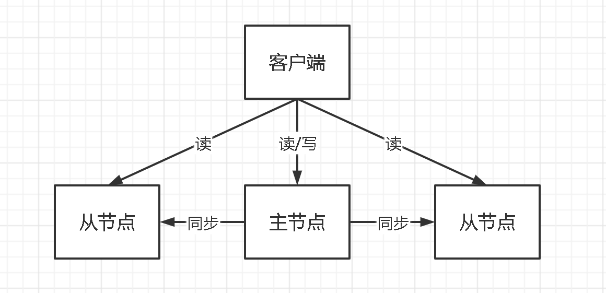
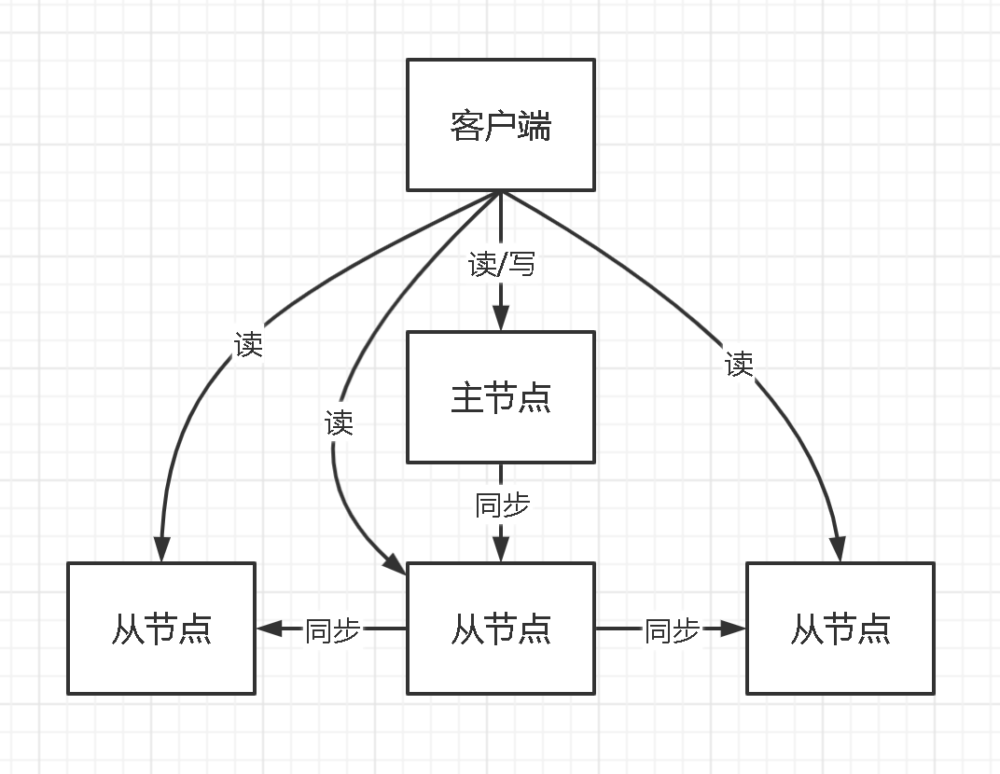
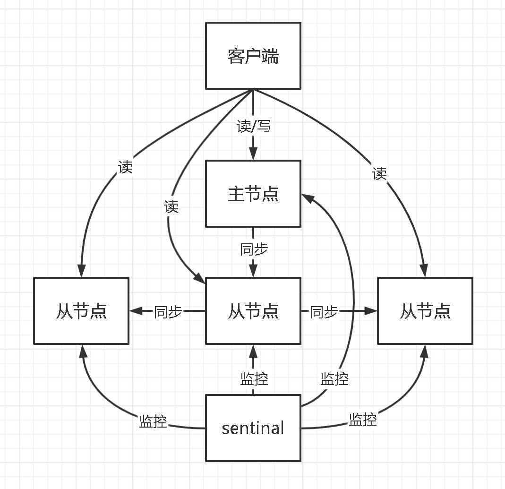
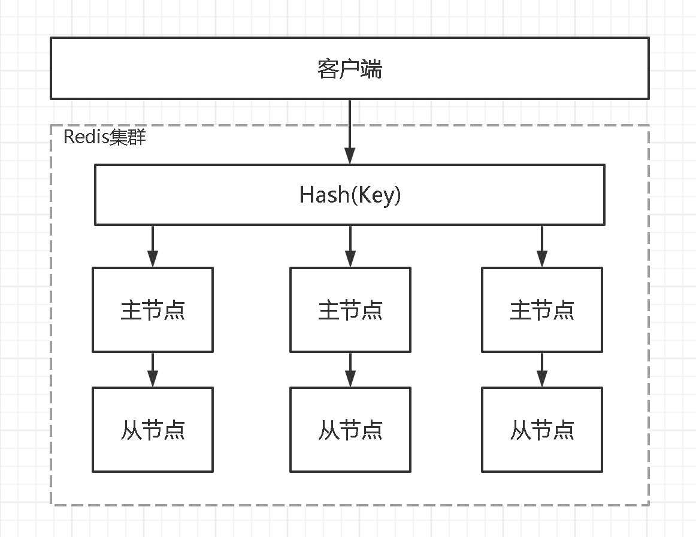

# Redis 高可用性<!-- omit in toc -->

## 目录<!-- omit in toc -->

- [1. 主从模式](#1-主从模式)
- [2. 哨兵模式](#2-哨兵模式)
- [3. 集群模式](#3-集群模式)

## 1. 主从模式

主从模式就是，部署多个 Redis 节点，其中只有一个节点是主节点（master），其他节点都是从节点（slave）。主从模式实现读写分离，只有 master 节点提供数据的事务性操作（增删改），slave 节点只提供读操作。所有 slave 节点的数据都是从 master 节点同步过来的，该模式的结构图如下：

上图是一种简单的主从结构模式，它的 slave 节点都挂在 master 节点上，这样做的优点是 slave 节点与 master 节点的数据延迟较小。缺点是如果 slave 节点数量很多，master 同步一次数据的时间花费较长。可以只在 master 节点下只挂载一个 slave 节点，其他节点挂载在这个 salve 节点上，数据同步经过传递完成，如下图所示。Redis 和大部分中间件的主从模式中的数据同步都是由 slave 节点主动发起的，这样可以减少 master 的性能消耗。

优点：

- 配置简单，容易搭建。
- 实现读写分离，降低 master 节点的读数据压力，提高系统的性能。

缺点：

- 主从模式在出现故障时，需要人为进行干预。
- 所有的写数据的压力都集中在 master 节点，没有解决 master 节点写的压力。

## 2. 哨兵模式

在主从模式中，一旦 master 节点发生宕机，为了保证高可用，需要找一个 slave 节点作为新的 master 节点。谁来确定宕机，选择哪一个 slave 节点，这些问题都没有解决。哨兵模式（sentinal）则是为了解决这些问题而产生的，它用于对主从模式中每个节点进行监控，当出现故障时通过投票机制，选择新的 master 节点，并将所有的 slave 节点连接到 master 节点，架构如下图所示。

哨兵模式有三个作用：监控、通知和自动故障转移。

- 监控（Monitoring）：不断地检查 master 和 salve 是否运行正常。master 存活检测、master 和 slave 运行情况检测。
- 通知（Notification）：当被监控的某个节点出现问题时， Sentinel 可以通过 API 向管理员或者其他应用程序发送通知。
- 自动故障转移（Automatic failover）：断开 master 与 slave 之间的连接，选取一个 salve 作为 master，将其他 slave 连接到新的 master，并告知客户端新的节点地址。

优点：

- 保证高可用。
- 能够监控各个节点运行状况，进行自动故障转移。

缺点：

- 中心化集群实现方式，基于主从模式，切换节点时，可能会发生数据的丢失。
- 集群里所有节点保存的都是全量数据，浪费内存空间，没有真正实现分布式存储。
- 数据量过大时，主从同步严重影响 master 的性能。
- 数据写的操作都集中在 master 上，仍然没有解决 master 写数据的压力。

## 3. 集群模式

哨兵模式基本已经实现了高可用，但是每个节点都存储相同的内容，很浪费内存。而且，哨兵模式没有解决 master 写数据的压力。为了解决这些问题，就有了集群模式，实现分布式存储，每个节点存储不同的内容。集群部署的方式能自动将数据进行分片，每个 master 上放一部分数据，提供了内置的高可用服务，即使某个 master 宕机了，服务还可以正常地提供，架构如下图所示：

集群模式中数据通过数据分片的方式被自动分割到不同的 master 节点上，每个 Redis 集群有 16384 个哈希槽，进行 set 操作时，每个 key 会通过 CRC16 校验后再对 16384 取模来决定放置在哪个槽。数据在集群模式中是分开存储的，那么节点之间想要知道其他节点的状态信息，包括当前集群状态、集群中各节点负责的哈希槽、集群中各节点的 master-slave 状态、集群中各节点的存活状态等是通过建立 TCP 连接，使用 gossip 协议来进行集群信息传播。

故障判断方法：判断故障的逻辑其实与哨兵模式有点类似，在集群中，每个节点都会定期的向其他节点发送 ping 命令，通过有没有收到回复来判断其他节点是否已经下线。具体方法是采用半数选举机制，当 A 节点发现目标节点疑似下线，就会向集群中的其他节点散播消息，其他节点就会向目标节点发送命令，判断目标节点是否下线。如果集群中半数以上的节点都认为目标节点下线，就会对目标节点标记为下线，从而告诉其他节点，让目标节点在整个集群中都下线。

优点：

- 无中心结构，部署简单。
- 所有的 Redis 节点彼此互联（PING-PONG 机制），内部使用二进制协议优化传输速度和带宽。
- 可扩展性，可扩展 master 节点，释放单个 master 的写数据压力，节点可动态添加或删除。
- 能够实现自动故障转移，节点之间通过 gossip 协议交换状态信息，用投票机制完成 slave 到 master 的角色转换。
